# 2022全國資訊學科能力競賽 解說（NHSPC2022 Editorial）

---

## A - base

---

## B - bicycle

最小權最大二分匹配：

這題可以看成是腳踏車與空位之間的最小權最大二分匹配，可以建出一張完全二分圖 K<sub>n,m</sub>，邊權即為移動的距離。

可以用 costflow 或者匈牙利算法解，複雜度可以做到 O((n+m)<sup>3</sup>)。

----

交換率：

設 b<sub>1</sub>, b<sub>2</sub> 為兩台腳踏車座標， s<sub>1</sub>, s<sub>2</sub> 為兩個空位座標。
且 b<sub>1</sub> < b<sub>2</sub> < s<sub>1</sub> < s<sub>2</sub>。

可以發現移動方式 b<sub>1</sub>s<sub>1</sub> b<sub>2</sub>s<sub>2</sub> 與 b<sub>1</sub>s<sub>2</sub> b<sub>2</sub>s<sub>1</sub>
的移動總距離是一樣的。

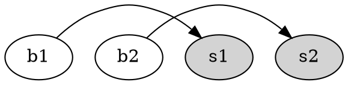

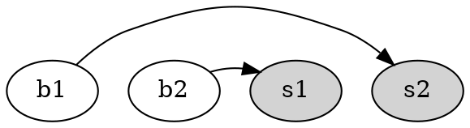

(b=腳踏車, s=空位)

----

O(nm) DP：

根據上面的交換率，必定存在一組最佳解，使得**座標越大的腳踏車移動到的空位座標也越大**。

我們可以記錄 `dp[i][j]` = 從左到右前 i 台腳踏車都歸還，最後一台腳踏車歸還在從左到右第 j 空位的最小花費。
其中轉移可以用紀錄前綴最小值的方式均攤 O(1)，
並且 DP 表格可以只記錄兩列因此空間複雜度可以省略到 O(m)。

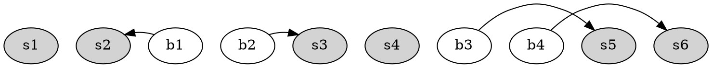
(腳踏車位置越大，移動到的位置越大)

----

O(m log m) DP：

**性質1**： 根據上面的交換率，必定存在一組最佳解，使得每台腳踏車以及其歸還位置的連線線段**不存在部分相交**，
也就是說要嘛一線段完全包含另一線段，或者完全不相交。
（例如 b<sub>1</sub> < b<sub>2</sub> < s<sub>1</sub> < s<sub>2</sub>， b<sub>1</sub>s<sub>1</sub> b<sub>2</sub>s<sub>2</sub> 
這個還法有部分相交，但可以換成 b<sub>1</sub>s<sub>2</sub> b<sub>2</sub>s<sub>1</sub>）

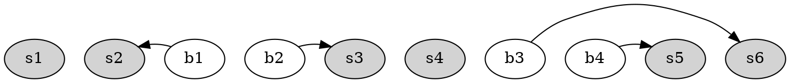
(一個不存在部分相交的例子)

**性質2**： 若有一**不存在部分相交**的最佳解，在這個解裡腳踏車 b 還車到空位 s，則 b,s 之間所有空位一定都有停還來的腳踏車 ⇛
很容易反證，如果 b, s 間存在一個空位沒還車，則我們可以把 b,s 間的所有腳踏車還的位置全部往空位的方向靠，可以構造出一組移動距離更小的解。

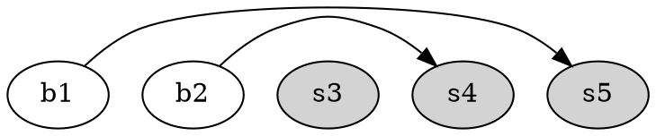
(b1, s5 中間有一個空位未使用)

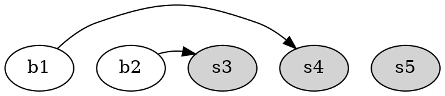
(b1, b2歸還點都往左移填滿空格，可以構造出一個更好的解)

**算法**：

根據以上兩個性質，可以發現一輛腳踏車 b 只會有兩個可能被歸還的地方：

* l<sub>b</sub>: 在 b 左邊，滿足 [l<sub>b</sub>, b] 間腳踏車與空格數量相等，座標最大的空位
* r<sub>b</sub>: 在 b 右邊，滿足 [b, r<sub>b</sub>] 間腳踏車與空格數量相等，座標最小的空位

對於每輛腳踏車所對應到的 l<sub>b</sub>, r<sub>b</sub>，可以用類似括號匹配的方法應用 stack 在線性時間求出。
求出所有連線 [l<sub>b</sub>, b], [b, r<sub>b</sub>] 之後，可以再做一次 DP，
紀錄每一個前綴連線匹配完所需要花的總距離，轉移會需要查詢最大值的資料結構做輔助，複雜度為 O(m log m)。

---

## C - card

Ω(2<sup>n</sup>) 做法：

每一回合可以枚舉要選擇最左邊還最右邊的卡片，全枚舉的話因為一共有 n 回合所以複雜度為 Ω(2<sup>n</sup>)。

----

O(n<sup>2</sup>) 做法：

可以用 DP 來記錄可得到的最大分數，例如狀態 `dp[x][y]` = [x, y] 選完區間的卡片能得的最大分數，則我們有

- 初始狀態：`dp[x][x] = cost(x, n)`
- 轉移： `dp[x][y] = max{dp[x][y-1] + cost(y, n-y+x), dp[x+1][y] + cost(x, n-y+x)}`

其中 cost(a, b) 是指卡片 a 在第 b 回合選的得分，轉移為 O(1)。

---

## D - editor

---

## E - gears

這題的齒輪方向以及轉速是可以分開討論的:

* 旋轉方向：由左至右，每遇到一個「接合」方向乘以 -1，否則不改變方向
* 旋轉速度：若第 $i$, $i+1$ 個齒輪為接合（$c_i = 1$），轉速除以 $i$ 的齒數乘以 $i+1$ 的齒數，否則轉速不變

複雜度是 O(n)。

---

## F - scratchcard

---

## G - tree

### 簡化問題

若一棵樹 $T$ 的節點 $i$ 的度數為 $d_i$，則 $i$ 在 $T$ 的 Prüfer 序列裡會恰出現 $d_i-1$ 次。反過來說，對任意序列 $\mathbf{p} = p_1, p_2, \ldots, p_{n-2}$，其中 $p_i = 1, 2, \ldots, n$，我們都能找到對應的樹 $T(\mathbf{p})$ 使得 $T(\mathbf{p})$ 的 Prüfer 序列為 $\mathbf{p}$。

要把一個 Prüfer 序列還原成一棵樹，首先我們必須算出這棵樹的度數序列：

> $n \gets |\mathbf{p}|+2$<br/>
> $\mathbf{d} \gets \underbrace{1, 1, \ldots, 1}_{n\text{ copies}}$<br/>
> **for** $p_i$ **in** $\mathbf{p}$ **do**<br/>
> &nbsp;&nbsp;𝑑<sub>𝑖</sub> $\gets d_i+1$<br/>
> **end** **for**

有了度數序列後，就能仿照 Prüfer 序列的生成步驟，逐步把邊加上去：

> $T \gets n$ isolated vertices<br/>
> **for** $p_i$ **in** $\mathbf{p}$ **do**<br/>
> &nbsp;&nbsp;𝑢 $\gets$ the smallest index $i$ satisfying $d_i = 1$<br/>
> &nbsp;&nbsp;Add edge $up_i$ to $T$<br/>
> &nbsp;&nbsp;𝑑<sub>𝑝<sub>𝑖</sub></sub> $\gets d_{p_i}-1, d_u \gets d_u-1$<br/>
> **end** **for**<br/>
> $u, v \gets$ the remaining $2$ indices $i$ satisfying $d_i = 1$<br/>
> Add edge $uv$ to $T$

執行這份虛擬碼後，𝑇 的 Prüfer 序列即為 $\mathbf{p}$。因此本題能簡化成這樣：

> 給定一個序列 $d_1, d_2, \ldots, d_n$，請求出 $i$ 恰出現 $d_i-1$ 次的字典序第 $k$ 小序列。

為了方便，以下假定我們想求 $i$ 恰出現 $n_i$ 次的第 $k$ 小序列，其中 $1 \le i \le m, n_1+n_2+\ldots+n_m = n-2$，且每個 $i$ 均有 $n_i > 0$。

### $O(n^2)$ 演算法

首先觀察滿足條件的序列個數為

$$K := \frac{(n_1+n_2+\ldots+n_m)!}{n_1! n_2! \ldots n_m!}.$$

如果輸入的 $k$ 大於 $K$，直接輸出 $-1$；否則，觀察以 $i$ 為開頭的序列個數為

$$K_i := \frac{(n_1+\ldots+n_m-1)!}{n_1! \ldots (n_i-1)! \ldots n_m!} = K\frac{n_i}{n_1+\ldots+n_m}.$$

計算 $K_1$ 需要 $O(n)$ 時間，接著由於

$$K_i = K_1\frac{n_i}{n_1},$$

可以用 $O(m)$ 時間算出其他的 $K_i$。總共有 $O(n)$ 格要填，故時間複雜度為 $O(n^2)$。

### 更快的演算法

雖然不是本題的考點，由於 $k$ 最大只到 $10^9$，相較 $(n-2)!$ 不大，我們可以利用 $k$ 來得到一個接近線性的演算法。

首先，若 $m \ge 14$，則 $K_1 \ge 13! > 10^9$，故此時可以直接填 $1$；另一方面，若 $m \le 13$，為了在 $O(m)$ 時間內算出 $K_1$，我們必須在 $O(1)$ 時間內算出

$$\frac{(n_1+\ldots+n_{l-1})\times(n_1+\ldots+n_{l-1}+1)\times\cdots\times(n_1+\ldots+n_{l-1}+n_l-1)}{n_l!} = \binom{n_1+\ldots+n_l-1}{n_l}.$$

因此需要先算好所有在 $10^9$ 內的 $\binom{r}{s}$。由於 $\binom{r}{s} = \binom{r}{r-s}$，以下只考慮 $2s \le r$ 的情況。當 $s \le 2$ 時，可以直接回傳計算結果；當 $s \ge 3$ 時，可以在 compile time 建表計算完成：

```cpp
constexpr int K = 1'000'000'000;
constexpr int R = 2000; // any integer n satisfying binom(n, 3) > K
constexpr int S = 20; // any integer n satisfying binom(2n, n) > K
constexpr std::array<std::array<int, S>, R> get_binom(){
  std::array<std::array<int, S>, R> res{};
  res[0][0] = 1;
  for(int i=1; i<R; ++i){
    res[i][0] = 1;
    for(int j=1; j<S; ++j){
      res[i][j] = std::min(res[i-1][j-1]+res[i-1][j], K+1);
    }
  }
  return res;
}
constexpr std::array<std::array<int, S>, R> Binom = get_binom();
```

因此字典序第 $k$ 小序列可以在 $O(\mu n)$ 時間得到，這裡 $\mu$ 是滿足 $\mu! \ge k$ 的任意整數，以本題來說可以取 $\mu = 13$。

---

## H - ussr

本題要找一個 $n$ 個點的連通 $k$-[正則](https://en.wikipedia.org/wiki/Regular_graph)[平面](https://en.wikipedia.org/wiki/Planar_graph)圖，其中每個頂點都是整數點，且每條邊都是直線線段。觀察 $\lvert E\rvert = \frac{k}{2}n$，而平面圖只要 $\lvert V\rvert \ge 3$ 就有 $\lvert E\rvert \le 3\lvert V\rvert-6$，可知 $k \ge 6$ 必定無解。以下我們對 $k \le 5$ 做逐一說明。

### 情況 1：$k = 1$

這個情況只有 $n=2$ 有解，其餘無解，構造方式只要取 $P_1(0, 0)$ 和 $P_2(0, 1)$ 並把兩點連起來就行了。

### 情況 2：$k = 2$

這個情況對所有的 $n \ge 3$ 都有解，構造方式就是造一個[圈](https://en.wikipedia.org/wiki/Cycle_graph) (cycle graph) $C_n$。

### 情況 3：$k = 3$

由於 $nk$ 必須是偶數，有解的必要條件是 $n$ 為 $4$ 以上的偶數，而仔細觀察能發現這其實也是充分條件。當 $n = 4$ 時，範例測試 $3$ 給出了同構於[完全圖](https://en.wikipedia.org/wiki/Complete_graph) $K_4$ 的構造法。當 $n \ge 6$ 時，我們寫 $n = 2m$。可以構造兩個圈 $C_m$，一內一外，設之為 $A = (\{a_1, \ldots, a_m\}, \{a_1a_2, \ldots, a_ma_1\})$ 與 $B = (\{b_1, \ldots, b_m\}, \{b_1b_2, \ldots, b_mb_1\})$，並把對應的點 $a_ib_i$ 連起來，就得到了符合題目要求的解。

### 情況 4：$k = 4$

首先我們有 $|E| = 2n \le 3n-6$，可推得 $n \ge 6$。對於 $6$ 以上的偶數，我們寫 $n = 2m$，仿照 $k = 3$ 的情況，一樣先構造連通 $3$-正則平面圖，再把 $a_1b_2, a_2b_3, \ldots, a_mb_1$ 連起來，就得到了符合題目要求的解。

當 $n$ 為 $9$ 以上的奇數時，我們寫 $n = 2m+1$，其中 $m \ge 4$。先構造好 $n-1$ 個點的連通 $4$-正則平面圖，並在 $A$ 的中心加入一個點 $u$。拔掉 $a_1a_2$ 與 $a_3a_4$ 兩條邊，並加入 $ua_1, ua_2, ua_3, ua_4$ 這 $4$ 條邊，就得到了符合題目要求的解。

我們說明 $n=7$ 無解。假定 $G$ 為一個有 $7$ 個頂點的 $4$-正則平面圖。隨意取兩個不相鄰的點 $v_1, v_2$，則由 $\deg(v_1) = \deg(v_2) = 4$，可知 $v_1$ 與 $v_2$ 的共同鄰居至少有 $3$ 個。若 $v_1$ 與 $v_2$ 的共同鄰居有 $4$ 個，設之為 $u_1, u_2, u_3, u_4$，則剩下不與 $v_1$ 與 $v_2$ 相鄰的那個點 $v_3$ 的鄰居也只能是 $u_1, u_2, u_3, u_4$，但此時 $\{v_1, v_2, v_3\}$ 與 $\{u_1, u_2, u_3\}$ 形成了一個[完全二分圖](https://en.wikipedia.org/wiki/Complete_bipartite_graph) $K_{3, 3}$，與 $G$ 為平面圖矛盾。

所以 $v_1$ 與 $v_2$ 的共同鄰居只能是 $3$ 個，不妨設 $v_1$ 與 $v_2$ 的共同鄰居為 $v_3, v_4, v_5$，而 $v_1$ 與 $v_6$ 相鄰，$v_2$ 與 $v_7$ 相鄰。若 $v_6$ 與 $v_7$ 不相鄰，則 $v_6$ 和 $v_7$ 也與 $v_3, v_4, v_5$ 相鄰，此時 $v_1, v_2, v_6$ 與 $v_3, v_4, v_5$ 形成了 $K_{3, 3}$，與 $G$ 為平面圖矛盾。

所以 $v_6$ 與 $v_7$ 只能相鄰。此時它們與 $v_3, v_4, v_5$ 中的恰兩個相鄰，不妨設 $v_6$ 與 $v_3, v_4$ 相鄰且 $v_7$ 與 $v_4, v_5$ 相鄰。但這樣一來 $v_1, v_2, v_6$ 和 $v_3, v_4, v_5$ 形成了 $K_{3, 3}$ 的[細分圖](https://mathworld.wolfram.com/GraphSubdivision.html) (subdivision)，其中 $v_5$ 到 $v_6$ 的邊中間經過了 $v_7$，矛盾。

### 情況 5：$k = 5$

首先我們有 $2|E| = 5n \le 6n-12$，可推得有解的必要條件是 $n$ 為 $12$ 以上的偶數。對於 $n = 12, 16, 18, 20, 22, 26$，以下給出了構造法：

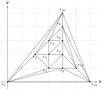

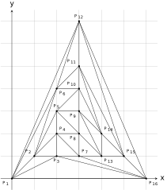

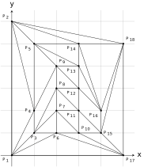

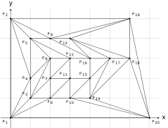

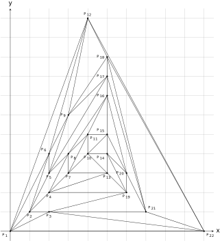

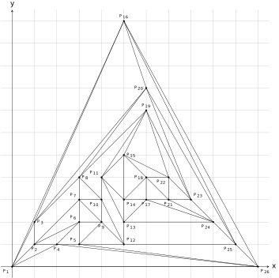

當 $n$ 為 $24$ 以上的偶數時，我們先構造 $12$ 與 $n-12$ 的圖，再將兩張圖「黏」起來就可得到。以下展示 $n=28=16+12$ 的構造方法：

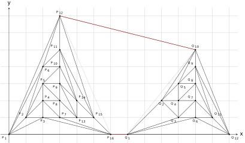

---

## I - xmas
